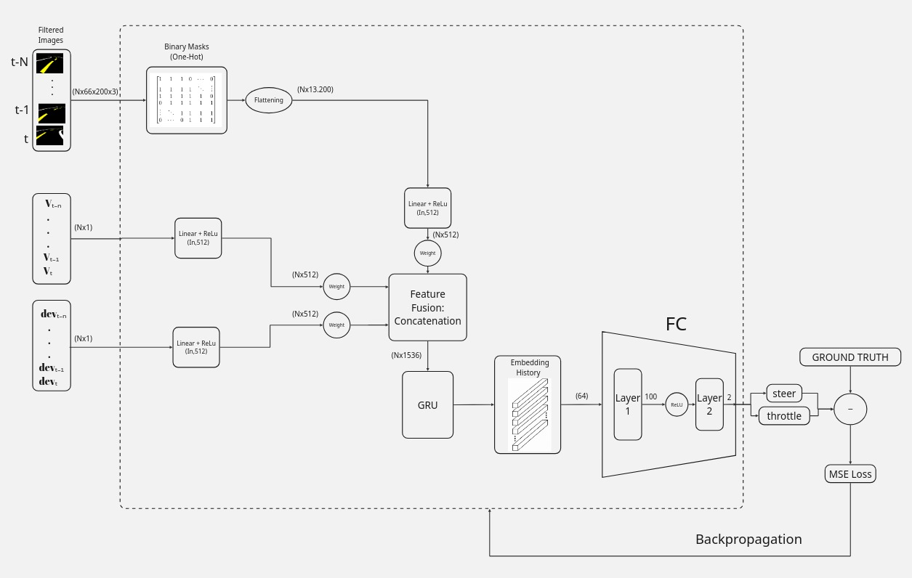

# GRU Architecture Evolution

## **Date:** May 13, 2026

### Objectives

Develop a GRU architecture capable of fusing heterogeneous data. The objective is to project inputs of different sizes into a unified latent space, guaranteeing equal feature representation in the final concatenated vector.

### Architecture structure

1. **Inputs:** The model receives historical sequences ($N$ time steps) from three sources: a binary track mask (vision), the current velocity, and the deviation from the center.
2. **Dimensional Equalization (Embeddings):** To prevent the massive amount of visual data from overshadowing the sensors, each input passes through its own linear layer (`Linear + ReLU`). This projects all sources to the exact same size (**512 dimensions**), giving them equal structural weight.
3. **Smart Fusion (Learnable Weights):** Before concatenating the data, the network applies dynamic weights to each vector. This allows the model to automatically learn to prioritize which information is most reliable in a given situation (e.g., relying more on the deviation sensor if the vision mask is ambiguous).
4. **Temporal Memory (GRU):** The concatenated vectors feed into a **GRU** layer, which processes the evolution of the sequence over time to understand the dynamic physical context of the vehicle.
5. **Decision Making (Output):** Finally, a fully connected (FC) layer head translates the temporal state of the GRU into two continuous control commands: **Steering** and **Throttle**.

  

